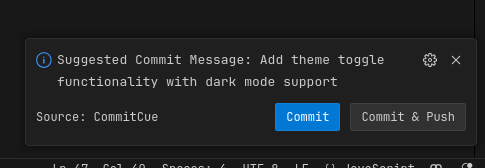

# CommitCue
CommitCue is a simple extension that helps you determine when to commit and what commit message to use.

## Features

As mentioned above, the main feature is commit suggestions:

You can easily accept this suggestion with the buttons provided below the commit message suggestion.

## Requirements

This extension works only in git repositories and on tracked files. This means that it won't work on any file that is in .gitignore.
You have to have Git on your computer.
You'll have to provide your OpenAI API key.

## Known Issues

You won't get any suggestions on new files until you start tracking them with git.

## Release Notes
### 1.0.0

Initial release of CommitCue:
- Basic Suggestions

## Suggestions & Support
If you like this extension, please star it on [GitHub](https://github.com/Olda-Hal/Commit-Cue).
You may also leave any suggestions or bug reports there as an Issue.
